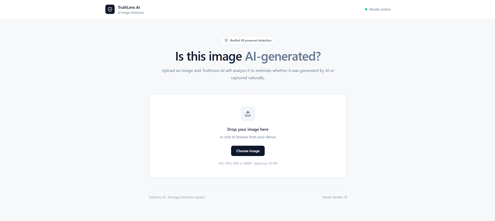
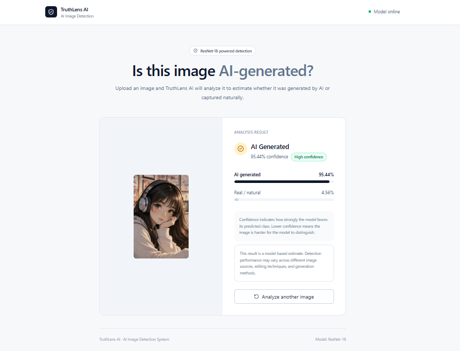
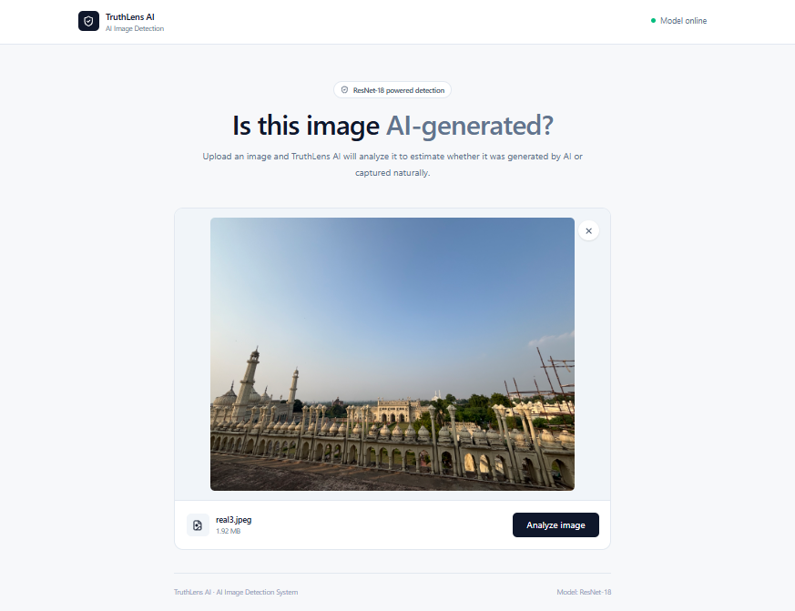

# Fake Image Detection System

### XtraGrad Internship – Major Project

An AI-powered image detection system that analyzes an uploaded image and predicts whether it is **AI-generated** or **Real/Natural**.

This project was developed as a **Major Project during the XtraGrad Internship**, combining deep learning, backend API development, and a modern web-based frontend into a complete end-to-end application.

---

## Project Overview

The rapid growth of generative AI has made it increasingly difficult to distinguish AI-generated images from authentic photographs and naturally captured images.

This project addresses this problem by developing a deep-learning-based binary image classifier using **ResNet-18**.

The trained model is integrated into a **FastAPI backend** and a **React + TypeScript frontend**, allowing users to upload an image and receive:

- AI-generated / Real prediction
- AI probability
- Real probability
- Confidence score
- Confidence-level interpretation

---

## Live Interface Screenshots

The following screenshots show the actual working web application.

### 1. Home / Upload Page



Users can upload an image by selecting a file or using drag-and-drop.

### 2. Fake Test Analysis Result



The selected image is previewed before sending it for analysis.

### 3. Real Test Analysis Result



The application displays the predicted class, confidence, and AI/Real probability scores.

---

## Key Features

- AI-generated vs Real image classification
- ResNet-18 deep learning model
- Robustly trained model
- Image upload through web interface
- Drag-and-drop image upload
- Image preview
- AI probability score
- Real probability score
- Confidence score
- Confidence-level interpretation
- FastAPI REST API
- React + TypeScript frontend
- Tailwind CSS interface
- JPG, JPEG, PNG and WEBP support
- Maximum 10 MB image upload
- Error handling
- CUDA/GPU support when available

---

## System Architecture

```text
                         USER
                           │
                           ▼
                ┌─────────────────────┐
                │   React Frontend    │
                │ React + TypeScript  │
                │    Tailwind CSS     │
                └──────────┬──────────┘
                           │
                           │ HTTP POST
                           │ /predict
                           ▼
                ┌─────────────────────┐
                │   FastAPI Backend   │
                │     Python API      │
                └──────────┬──────────┘
                           │
                           ▼
                ┌─────────────────────┐
                │ Image Preprocessing │
                │ Resize + Normalize  │
                └──────────┬──────────┘
                           │
                           ▼
                ┌─────────────────────┐
                │     ResNet-18       │
                │ Binary Classifier   │
                └──────────┬──────────┘
                           │
                  ┌────────┴────────┐
                  ▼                 ▼
           AI Generated       Real / Natural
```

---

## Workflow

```text
Upload Image
     ↓
Frontend Validation
     ↓
Image Preview
     ↓
POST /predict
     ↓
FastAPI Backend
     ↓
Image Preprocessing
     ↓
ResNet-18 Model
     ↓
Class Probabilities
     ↓
Prediction + Confidence
     ↓
Frontend Result Display
```

### Step-by-Step

1. The user selects or drops an image into the web application.
2. The frontend validates the image format and file size.
3. The selected image is displayed as a preview.
4. The frontend sends the image to the FastAPI `/predict` endpoint.
5. The backend reads and preprocesses the image.
6. The image is resized to 224 × 224 pixels.
7. ImageNet normalization is applied.
8. The processed image is passed to the ResNet-18 model.
9. The model generates probabilities for both classes.
10. The backend returns the prediction and confidence information.
11. The frontend displays the final result.

---

## Dataset

The primary dataset used for model development was the **GenImage ADM dataset**.

The dataset contained approximately:

- **319,447 usable training images**
- **12,000 validation images**
- **2 classes**

### Classes

| Class | Description |
|---|---|
| AI | AI-generated images |
| REAL | Real / natural images |

During dataset preparation, **six corrupted PNG files** were identified and removed from the training dataset.

---

## Application Screenshots

### Home / Upload Interface

The application provides a clean interface for uploading an image through file selection or drag-and-drop.


---

### AI-Generated Image Detection

The system displays the predicted AI-generated class along with confidence and probability scores.


---

### Real Image Detection

The system also provides the corresponding prediction and confidence information for images classified as real/natural.


---

## Machine Learning Model

The project uses a **ResNet-18 convolutional neural network** adapted for binary classification.

### Model Configuration

| Parameter | Value |
|---|---|
| Architecture | ResNet-18 |
| Task | Binary Classification |
| Input Size | 224 × 224 |
| Classes | 2 |
| Optimizer | AdamW |
| Original Learning Rate | 1e-4 |
| Original Epochs | 10 |
| Batch Size | 8 |
| Normalization | ImageNet |
| Mixed Precision | AMP |

The application uses:

```text
models/fake_image_resnet18_robust.pth
```

---

## Original Model Performance

The original ResNet-18 model achieved the following results on the GenImage ADM validation set:

| Metric | Result |
|---|---:|
| Accuracy | 99.91% |
| Precision | 99.93% |
| Recall | 99.88% |
| F1 Score | 99.91% |
| ROC-AUC | 1.0000 |

### Confusion Matrix

```text
                 Predicted
                AI       REAL

Actual AI      5993       7
Actual REAL       4    5996
```

These results demonstrate strong performance on the original validation distribution.

---

## Robust Model

A second training process was performed to improve the model's ability to generalize to images outside the original training distribution.

The robust training pipeline included:

- Random resized cropping
- Random horizontal flipping
- Color jitter
- Random grayscale
- Gaussian blur
- Random erasing
- ImageNet normalization

### Robust Model Validation Result

```text
Validation Accuracy: 96.24%
```

The robust model is used by the web application.

---

## External Testing

To evaluate performance outside the original validation dataset, an external test set containing **24 images** was used.

| Category | Number of Images |
|---|---:|
| AI-generated | 11 |
| Real | 13 |
| Total | 24 |

### Original Model

| Category | Correct | Accuracy |
|---|---:|---:|
| AI-generated | 0 / 11 | 0.00% |
| Real | 13 / 13 | 100.00% |
| Overall | 13 / 24 | 54.17% |

### Robust Model

| Category | Correct | Accuracy |
|---|---:|---:|
| AI-generated | 8 / 11 | 72.73% |
| Real | 10 / 13 | 76.92% |
| Overall | 18 / 24 | 75.00% |

The external testing demonstrated a substantial difference between performance on the original validation dataset and performance on unseen images.

This highlights the importance of **model generalization and robustness** in AI-generated image detection.

The external dataset was relatively small and should not be considered representative of all real-world images or AI-generation methods.

---

## Confidence Interpretation

The application displays the model's confidence for its predicted class.

| Confidence | Interpretation |
|---|---|
| 90% and above | High Confidence |
| 70% – 89.99% | Moderate Confidence |
| Below 70% | Low Confidence |

Confidence indicates how strongly the model favors its predicted class.

It does **not** guarantee that the prediction is correct.

---

## Technologies Used

### Programming Languages

- Python
- TypeScript
- JavaScript

### Machine Learning

- PyTorch
- Torchvision
- ResNet-18
- CUDA
- NVIDIA GPU

### Backend

- FastAPI
- Uvicorn
- Pillow
- Python Multipart

### Frontend

- React
- TypeScript
- Vite
- Tailwind CSS
- Lucide React

### Development Tools

- Visual Studio Code
- Git
- GitHub
- PowerShell

---

## Backend API

The backend is implemented using FastAPI.

### Prediction Endpoint

```text
POST /predict
```

The endpoint accepts an image through multipart form data.

### Supported Formats

```text
JPEG
JPG
PNG
WEBP
```

### Maximum File Size

```text
10 MB
```

### Example Response

```json
{
  "filename": "example.jpg",
  "prediction": "AI Generated",
  "class": "AI",
  "confidence": 95.44,
  "ai_probability": 95.44,
  "real_probability": 4.56
}
```

---

## API Documentation

FastAPI automatically provides interactive API documentation.

After starting the backend, open:

```text
http://127.0.0.1:8000/docs
```

Health endpoint:

```text
GET /health
```

---

## Frontend

The frontend was developed using React and TypeScript.

The interface provides:

- Image upload
- Drag-and-drop support
- Image preview
- File validation
- Loading state
- Prediction result
- Probability visualization
- Confidence interpretation
- Error messages
- Analyze-again functionality

The frontend communicates with the backend through the FastAPI REST API.

---

## Installation

### 1. Clone the Repository

```bash
git clone https://github.com/Raaaaahil/Fake-Image-Detection.git
cd Fake-Image-Detection
```

---

## Backend Setup

Create a Python virtual environment:

```powershell
python -m venv .venv
```

Activate it:

```powershell
.\.venv\Scripts\Activate.ps1
```

Navigate to the backend:

```powershell
cd backend
```

Install dependencies:

```powershell
pip install -r requirements.txt
```

Start the backend:

```powershell
python -m uvicorn app:app --reload
```

Backend:

```text
http://127.0.0.1:8000
```

Swagger documentation:

```text
http://127.0.0.1:8000/docs
```

---

## Frontend Setup

Open a second terminal.

Navigate to:

```powershell
cd frontend
```

Install dependencies:

```powershell
npm install
```

Start the development server:

```powershell
npm run dev
```

Open the URL displayed by Vite in the terminal.

---

## Project Structure

```text
Fake-Image-Detection/
│
├── backend/
│   ├── app.py
│   ├── predictor.py
│   └── requirements.txt
│
├── frontend/
│   ├── src/
│   │   ├── App.tsx
│   │   ├── App.css
│   │   ├── index.css
│   │   └── main.tsx
│   ├── package.json
│   ├── package-lock.json
│   └── vite.config.ts
│
├── models/
│   ├── fake_image_resnet18.pth
│   └── fake_image_resnet18_robust.pth
│
├── docs/
│   └── screenshots/
│       ├── 01-home-upload.png
│       ├── 02-image-preview.png
│       └── 03-analysis-result.png
│
├── evaluate.py
├── evaluate_external.py
├── predict.py
├── train.py
├── train_robust.py
├── .gitignore
└── README.md
```

---

## Testing

The system was tested at multiple levels.

### Model Testing

- Validation dataset evaluation
- Confusion matrix analysis
- Accuracy
- Precision
- Recall
- F1 score
- ROC-AUC

### External Testing

- AI-generated images
- Real images
- Per-image prediction
- Confidence analysis
- Overall accuracy

### Application Testing

- Image upload
- Drag-and-drop
- File validation
- API communication
- Model inference
- Prediction display
- Error handling

---

## Challenges Faced

### Dataset Quality

Some images in the training dataset were corrupted and could not be processed.

**Solution:** Corrupted files were identified and removed before training.

### Model Generalization

The original model achieved very high validation accuracy but performed poorly on unseen external AI-generated images.

**Solution:** A robust training pipeline with stronger image augmentation was developed.

### Computational Requirements

Training the model required GPU acceleration and considerable system resources.

**Solution:** CUDA-enabled PyTorch and an NVIDIA GPU were used for model training.

### Backend and Frontend Integration

The machine-learning model needed to be integrated into a usable web application.

**Solution:** FastAPI was used as the inference backend and React was used to create the frontend.

---

## Learning Outcomes

Through this project, the following technical skills were developed:

- Deep learning model training
- CNN-based image classification
- PyTorch
- Transfer learning
- Image preprocessing
- Data augmentation
- Model evaluation
- Model generalization analysis
- REST API development
- FastAPI
- React and TypeScript
- Frontend-backend integration
- Git and GitHub
- Debugging and deployment preparation

The project provided practical experience in converting a machine-learning model into a complete user-facing application.

---

## Limitations

- The primary training dataset is GenImage ADM.
- External testing was performed on a relatively small set of 24 images.
- Some unseen AI-generated images may be classified as real.
- Some real images may be classified as AI-generated.
- Image compression and editing can affect predictions.
- Performance may vary across different AI-generation models.
- The system does not provide forensic proof of image authenticity.

Therefore, the system should be considered an **AI-based estimation tool**, not an absolute image-authenticity verification system.

---

## Future Enhancements

Possible future improvements include:

- Training with larger and more diverse datasets
- Including images from additional AI-generation models
- Transformer-based image detection models
- Ensemble-based detection
- Frequency-domain analysis
- Metadata analysis
- Image-forensics techniques
- Explainable AI visualizations
- Larger real-world evaluation datasets
- Cloud deployment
- Scalable inference services
- Continuous model improvement using new AI-generation techniques

---

## Project Outcome

The project resulted in a complete end-to-end AI image detection application.

```text
Machine Learning Model
        +
FastAPI Backend
        +
React Frontend
        =
Complete AI Image Detection Application
```

The project demonstrates the practical integration of **machine learning, backend development, frontend development, and model evaluation** into a single working system.

---

## Internship Context

**Program:** XtraGrad Internship

**Project Type:** Major Project

**Project Domain:** Artificial Intelligence / Machine Learning

**Project Focus:** AI-Generated Image Detection

This project was developed as part of the XtraGrad internship to gain hands-on experience in designing, training, evaluating, and integrating a machine-learning-based application.

---

## Disclaimer

This project provides a machine-learning-based estimate of whether an image appears AI-generated or real/natural.

The prediction should not be treated as definitive proof of image authenticity. Results may vary depending on the image source, generation method, editing, compression, and other factors.

---

## Repository

GitHub Repository:

https://github.com/Raaaaahil/Fake-Image-Detection
